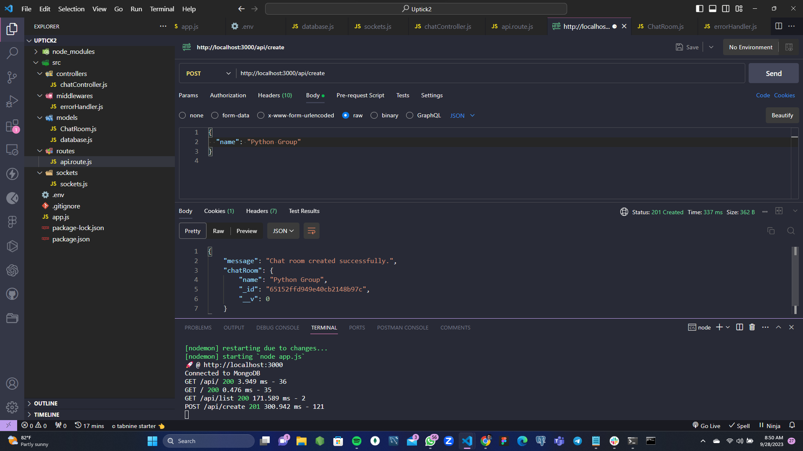
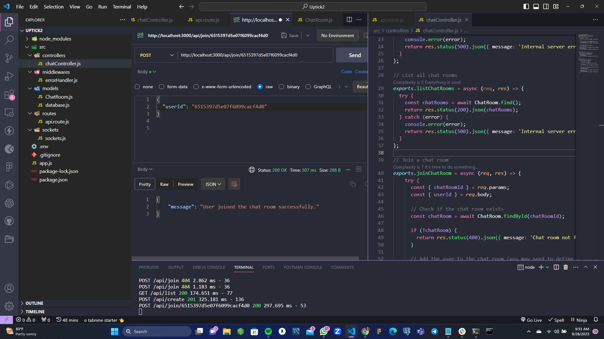
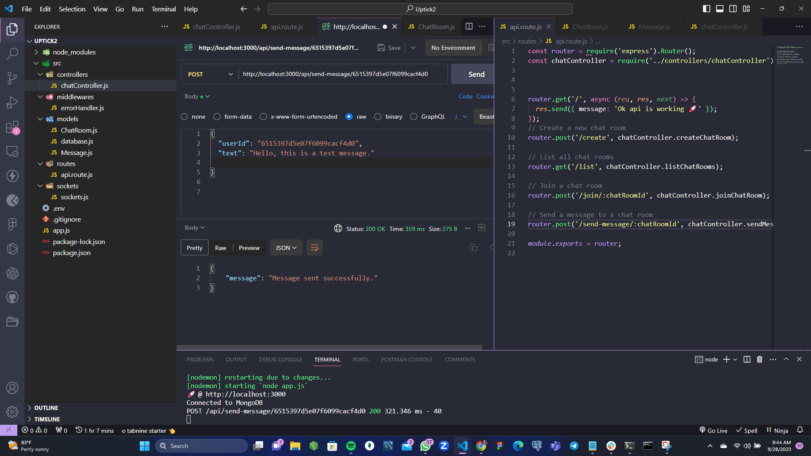

# Chat API Documentation

A simple distributed chat application API using WebSocket technology. Users can join chat rooms and exchange messages in real-time.

## Base URL

The base URL for all API endpoints is: `http://localhost:3000/api`

## Endpoints

### Create a Chat Room

- **URL:** `/chat/create`
- **Method:** `POST`
- **Description:** Create a new chat room.
- **Request Body:**
  - `name` (string, required): The name of the chat room.
- **Response:**
  - **Success (201 Created):** Returns the created chat room.
    - **Example:**
      ```json
      {
        "message": "Chat room created successfully.",
        "chatRoom": {
          "_id": "60fbb3213e04e52f84ebebab",
          "name": "General Chat"
        }
      }
      ```
  - **Error (400 Bad Request):** Invalid request or chat room name already exists.
    - **Example:**
      ```json
      {
        "message": "Chat room with this name already exists."
      }
      ```
  - **Error (500 Internal Server Error):** Internal server error.

### List Chat Rooms

- **URL:** `/chat/list`
- **Method:** `GET`
- **Description:** Retrieve a list of all available chat rooms.
- **Response:**
  - **Success (200 OK):** Returns an array of chat rooms.
    - **Example:**
      ```json
      [
        {
          "_id": "60fbb3213e04e52f84ebebab",
          "name": "General Chat"
        },
        {
          "_id": "60fbb3213e04e52f84ebebac",
          "name": "Tech Talk"
        }
      ]
      ```
  - **Error (500 Internal Server Error):** Internal server error.

### Join a Chat Room

- **URL:** `/chat/join/:chatRoomId`
- **Method:** `POST`
- **Description:** Allow a user to join a chat room.
- **Parameters:**
  - `chatRoomId` (string, URL parameter, required): The ID of the chat room to join.
- **Request Body:**
  - `userId` (string, required): The ID of the user joining the chat room.
- **Response:**
  - **Success (200 OK):** User joined the chat room successfully.
    - **Example:**
      ```json
      {
        "message": "User joined the chat room successfully."
      }
      ```
  - **Error (400 Bad Request):** Chat room not found.
    - **Example:**
      ```json
      {
        "message": "Chat room not found."
      }
      ```
  - **Error (500 Internal Server Error):** Internal server error.

### Send a Message to a Chat Room

- **URL:** `/chat/send-message/:chatRoomId`
- **Method:** `POST`
- **Description:** Allow a user to send a message to a chat room.
- **Parameters:**
  - `chatRoomId` (string, URL parameter, required): The ID of the chat room where the message is sent.
- **Request Body:**
  - `userId` (string, required): The ID of the user sending the message.
  - `text` (string, required): The content of the message.
- **Response:**
  - **Success (200 OK):** Message sent successfully.
    - **Example:**
      ```json
      {
        "message": "Message sent successfully."
      }
      ```
  - **Error (400 Bad Request):** Chat room not found.
    - **Example:**
      ```json
      {
        "message": "Chat room not found."
      }
      ```
  - **Error (500 Internal Server Error):** Internal server error.

### Retrieve Messages for a Chat Room

- **URL:** `/chat/messages/:chatRoomId`
- **Method:** `GET`
- **Description:** Retrieve all messages in a chat room.
- **Parameters:**
  - `chatRoomId` (string, URL parameter, required): The ID of the chat room for which messages are retrieved.
- **Response:**
  - **Success (200 OK):** Returns an array of messages in the chat room.
    - **Example:**
      ```json
      [
        {
          "_id": "60fbb3213e04e52f84ebebad",
          "sender": {
            "_id": "60fbb3213e04e52f84ebebba",
            "username": "john_doe"
          },
          "text": "Hello, everyone!",
          "chatRoom": "60fbb3213e04e52f84ebebab",
          "createdAt": "2022-08-25T12:30:45.678Z"
        },
        {
          "_id": "60fbb3213e04e52f84ebebae",
          "sender": {
            "_id": "60fbb3213e04e52f84ebebbb",
            "username": "jane_smith"
          },
          "text": "Hi, there!",
          "chatRoom": "60fbb3213e04e52f84ebebab",
          "createdAt": "2022-08-25T12:35:12.345Z"
        }
      ]
      ```
  - **Error (400 Bad Request):** Chat room not found.
    - **Example:**
      ```json
      {
        "message": "Chat room not found."
      }
      ```
  - **Error (500 Internal Server Error):** Internal server error.


# Screenshots of the endpoints



